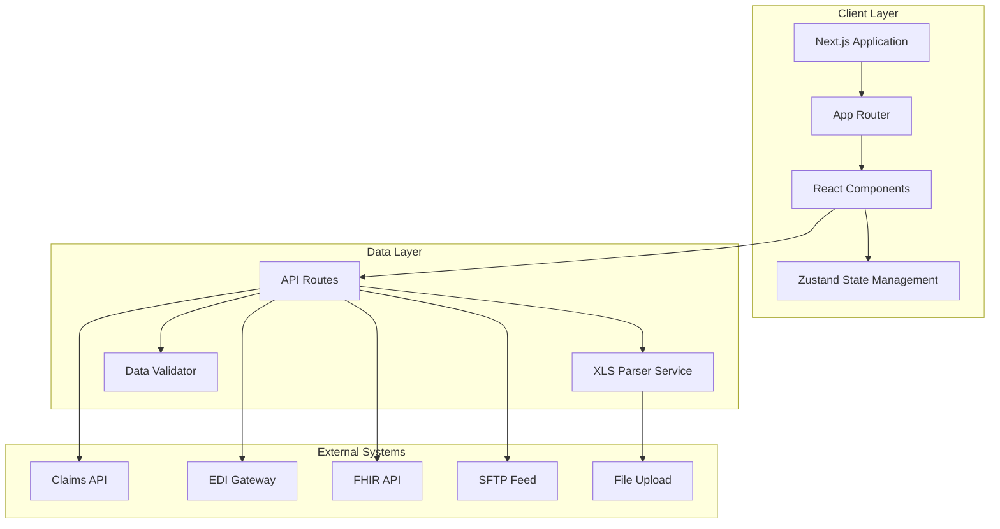
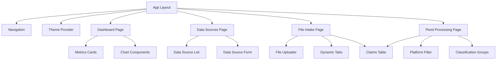

# Design Document: Claims Management UI

## Overview

The Claims Management UI is a modern, enterprise-grade web application built to streamline healthcare claims processing workflows. The system provides a comprehensive interface for managing claims data from multiple sources, supporting file uploads, dynamic data visualization, and flexible filtering capabilities.

### Core Capabilities

- **Multi-source Data Integration**: Aggregate claims from Claims API, EDI Gateway, File Upload, FHIR API, and SFTP Feed
- **Intelligent File Processing**: Parse and validate XLS files with comprehensive error handling
- **Dynamic Classification Management**: Auto-generate tabs and groupings based on claim classifications
- **Advanced Filtering**: Platform-based and classification-based filtering with multi-select support
- **Theme Flexibility**: Full light/dark theme support with user preference persistence
- **Performance Optimization**: Virtual scrolling, debouncing, and code splitting for handling large datasets

### Design Principles

1. **Component Modularity**: Isolated, reusable components with clear responsibilities
2. **Type Safety**: Comprehensive TypeScript coverage for compile-time error detection
3. **Performance First**: Optimized rendering for large datasets (1000+ claims)
4. **Accessibility**: WCAG 2.1 AA compliance for inclusive user experience
5. **Maintainability**: Clear separation of concerns with established architectural patterns

## Architecture

### High-Level Architecture



### Technology Stack

#### Core Framework
- **Next.js 14+** (App Router): React framework with server-side rendering, API routes, and optimized bundling
- **React 18+**: Component library with concurrent features and automatic batching
- **TypeScript 5+**: Type-safe development with advanced type inference

#### State Management
- **Zustand 4+**: Lightweight state management with minimal boilerplate
- **React Query (TanStack Query) 5+**: Server state management with caching, background updates, and optimistic updates

#### Styling & UI
- **Tailwind CSS 3+**: Utility-first CSS framework for rapid UI development
- **shadcn/ui**: High-quality, accessible component library built on Radix UI
- **Radix UI**: Unstyled, accessible component primitives
- **Lucide React**: Modern icon library with tree-shaking support

#### Data Processing
- **SheetJS (xlsx) 0.20+**: Excel file parsing with comprehensive format support
- **Zod 3+**: Schema validation with TypeScript type inference
- **date-fns 3+**: Modern date manipulation library

#### Development Tools
- **Vite/Turbopack**: Fast build tool with hot module replacement
- **ESLint 8+**: Code linting with TypeScript support
- **Prettier 3+**: Code formatting
- **Vitest**: Fast unit testing framework
- **Playwright**: End-to-end testing

### Component Architecture



## Components and Interfaces

### Core Components

#### 1. Layout Components


**AppLayout**
- Responsibilities: Root layout with navigation, theme provider, and global state
- Props: `children: ReactNode`
- State: Theme preference, navigation state
- Integration: Wraps all pages, provides context providers

**Navigation**
- Responsibilities: Main navigation menu with active state indication
- Props: `currentPath: string`
- State: None (controlled by router)
- Integration: Links to Dashboard, Data Sources, File Intake, Pend Processing

**ThemeProvider**
- Responsibilities: Theme management and persistence
- Props: `children: ReactNode`, `defaultTheme?: 'light' | 'dark'`
- State: Current theme, theme preference
- Integration: Provides theme context to all components

#### 2. Dashboard Components

**DashboardPage**
- Responsibilities: Orchestrate dashboard metrics display
- Props: None
- State: Claims data, loading state, error state
- Integration: Fetches aggregated metrics, renders metric cards

**MetricsCard**
- Responsibilities: Display individual metric with label and value
- Props: `title: string`, `value: number | string`, `icon?: ReactNode`, `trend?: number`
- State: None
- Integration: Reusable card for all dashboard metrics

**ClassificationChart**
- Responsibilities: Visualize claims distribution by classification
- Props: `data: ClassificationMetric[]`
- State: None
- Integration: Bar chart or pie chart component

**PlatformChart**
- Responsibilities: Visualize claims distribution by platform
- Props: `data: PlatformMetric[]`
- State: None
- Integration: Bar chart component


#### 3. Data Sources Components

**DataSourcesPage**
- Responsibilities: Manage data source configurations
- Props: None
- State: Data sources list, selected source, form state
- Integration: CRUD operations for data sources

**DataSourceList**
- Responsibilities: Display all configured data sources
- Props: `dataSources: DataSource[]`, `onEdit: (id: string) => void`, `onDelete: (id: string) => void`
- State: None
- Integration: Table or card list with action buttons

**DataSourceForm**
- Responsibilities: Add/edit data source configuration
- Props: `dataSource?: DataSource`, `onSubmit: (data: DataSource) => void`, `onCancel: () => void`
- State: Form values, validation errors
- Integration: Dynamic form based on data source type

**DataSourceTypeSelector**
- Responsibilities: Select data source type (Claims API, EDI Gateway, etc.)
- Props: `value: DataSourceType`, `onChange: (type: DataSourceType) => void`
- State: None
- Integration: Radio group or dropdown

#### 4. File Intake Components

**FileIntakePage**
- Responsibilities: Orchestrate file upload and claims display
- Props: None
- State: Uploaded claims, active tab, loading state
- Integration: File upload, parsing, tab generation, claims display

**FileUploader**
- Responsibilities: Handle XLS file upload with validation
- Props: `onUpload: (file: File) => void`, `maxSize?: number`
- State: Upload progress, validation errors
- Integration: Drag-and-drop zone, file input, progress indicator


**DynamicTabs**
- Responsibilities: Generate tabs based on unique classifications
- Props: `classifications: string[]`, `counts: Record<string, number>`, `activeTab: string`, `onTabChange: (tab: string) => void`
- State: None (controlled)
- Integration: Tab component with dynamic generation

**ClaimsTable**
- Responsibilities: Display claims in sortable, searchable table with virtual scrolling
- Props: `claims: Claim[]`, `onSort: (column: string) => void`, `onSearch: (query: string) => void`
- State: Sort state, search query, visible rows
- Integration: Virtual scrolling library (react-virtual or tanstack-virtual)

**ClaimsTableRow**
- Responsibilities: Render individual claim row
- Props: `claim: Claim`, `style?: CSSProperties`
- State: None
- Integration: Optimized for virtual scrolling

#### 5. Pend Processing Components

**PendProcessingPage**
- Responsibilities: Display claims with platform filtering and classification grouping
- Props: None
- State: Claims data, selected platforms, expanded groups
- Integration: Fetches pend claims, applies filters, renders groups

**PlatformFilter**
- Responsibilities: Multi-select platform filter
- Props: `platforms: Platform[]`, `selected: Platform[]`, `counts: Record<Platform, number>`, `onChange: (selected: Platform[]) => void`
- State: None (controlled)
- Integration: Checkbox group with counts

**ClassificationGroup**
- Responsibilities: Collapsible group of claims by classification
- Props: `classification: string`, `claims: Claim[]`, `expanded: boolean`, `onToggle: () => void`
- State: None (controlled)
- Integration: Accordion component with claims table


### Component Interfaces

```typescript
// Core Types
type Platform = 'Facet' | 'Amisys' | 'Xcelys';
type Classification = 'DUAL' | 'Duplicate' | 'COB' | 'Pricing' | 'Auth' | 'Corrected Claims' | 'High Dollar' | 'Other Pend';
type ClaimStatus = 'Pending' | 'Approved' | 'Denied' | 'In Review';
type DataSourceType = 'Claims API' | 'EDI Gateway' | 'File Upload' | 'FHIR API' | 'SFTP Feed';

// Data Models
interface Claim {
  id: string;
  claimNumber: string;
  classification: Classification;
  platform: Platform;
  providerName: string;
  billedAmount: number;
  status: ClaimStatus;
  confidence: number; // 0-100
  daysAged: number;
  state: string; // US state code
  createdAt: Date;
  updatedAt: Date;
}

interface DataSource {
  id: string;
  name: string;
  type: DataSourceType;
  config: DataSourceConfig;
  status: 'active' | 'inactive' | 'error';
  lastSync?: Date;
  createdAt: Date;
  updatedAt: Date;
}

type DataSourceConfig = 
  | ClaimsAPIConfig 
  | EDIGatewayConfig 
  | FileUploadConfig 
  | FHIRAPIConfig 
  | SFTPFeedConfig;

interface ClaimsAPIConfig {
  endpoint: string;
  apiKey: string;
  timeout?: number;
}


interface EDIGatewayConfig {
  host: string;
  port: number;
  username: string;
  password: string;
}

interface FileUploadConfig {
  allowedExtensions: string[];
  maxFileSize: number; // bytes
}

interface FHIRAPIConfig {
  baseUrl: string;
  version: string; // e.g., 'R4'
  authToken: string;
}

interface SFTPFeedConfig {
  host: string;
  port: number;
  username: string;
  privateKey: string;
  remotePath: string;
}

// Dashboard Metrics
interface DashboardMetrics {
  totalClaims: number;
  claimsByClassification: Record<Classification, number>;
  claimsByPlatform: Record<Platform, number>;
  claimsByStatus: Record<ClaimStatus, number>;
  totalBilledAmount: number;
  averageBilledAmount: number;
  averageDaysAged: number;
  lastUpdated: Date;
}

// File Upload
interface FileUploadResult {
  success: boolean;
  claimsParsed: number;
  errors: FileParseError[];
  claims: Claim[];
}

interface FileParseError {
  row: number;
  column?: string;
  message: string;
  severity: 'error' | 'warning';
}
```

## Data Models

### Entity Relationship Diagram

```mermaid
erDiagram
    CLAIM {
        string id PK
        string claimNumber UK
        string classification
        string platform
        string providerName
        number billedAmount
        string status
        number confidence
        number daysAged
        string state
        datetime createdAt
        datetime updatedAt
    }
